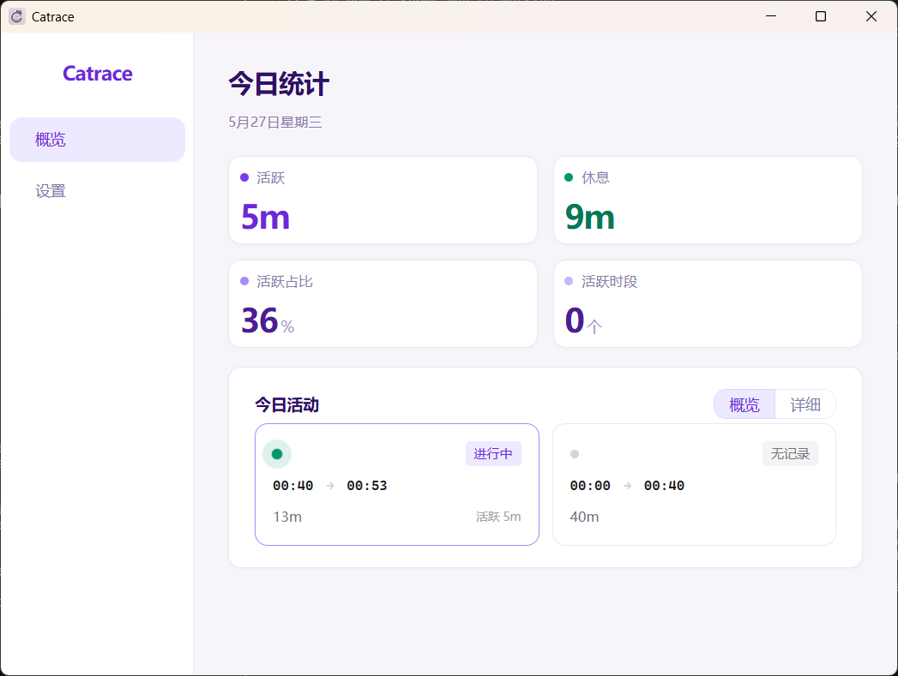

## 软件名称

Catrace

## 应用平台

- Windows
- macOS（有 bug）
- Linux（有 bug）

## 推荐类型

【开发者自荐】

## 一句简介

Catrace 是一款在桌面端记录键盘和鼠标活动，久坐提醒的小工具。

## 截图预览

## 应用简介

很久之前用番茄钟/定时器等等之类的软件来提醒自己休息，但是忙的时候，有时候会经常忘记，要么就忘记休息，要么忘记开启。每次番茄钟都需要自己手动开启，非常麻烦。

人到中年了，得爱惜自己的身体了，所以才有了这么个软件。

我用了觉得还可以，提醒我休息的目标达到了，发出来看看大家伙的意见。

主要的功能就是：记录你每一分钟的键盘和鼠标活动来判断当前是工作/休息，然后根据你设置的工作窗口长度和休息判定时长，来提醒你休息。

支持通知提醒，弹窗提醒，全屏提醒。

## 官方网站

项目主页：

https://github.com/lanxiuyun/Catrace

下载最新版本：

https://download.upgrade.toolsetlink.com/download?appKey=RBrITa0T5PKRzdYuwwxzow
