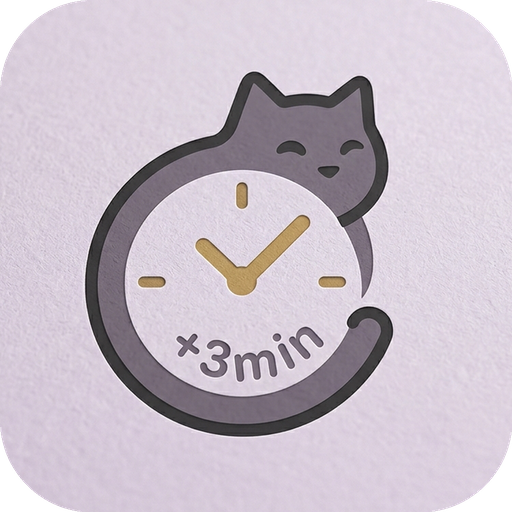
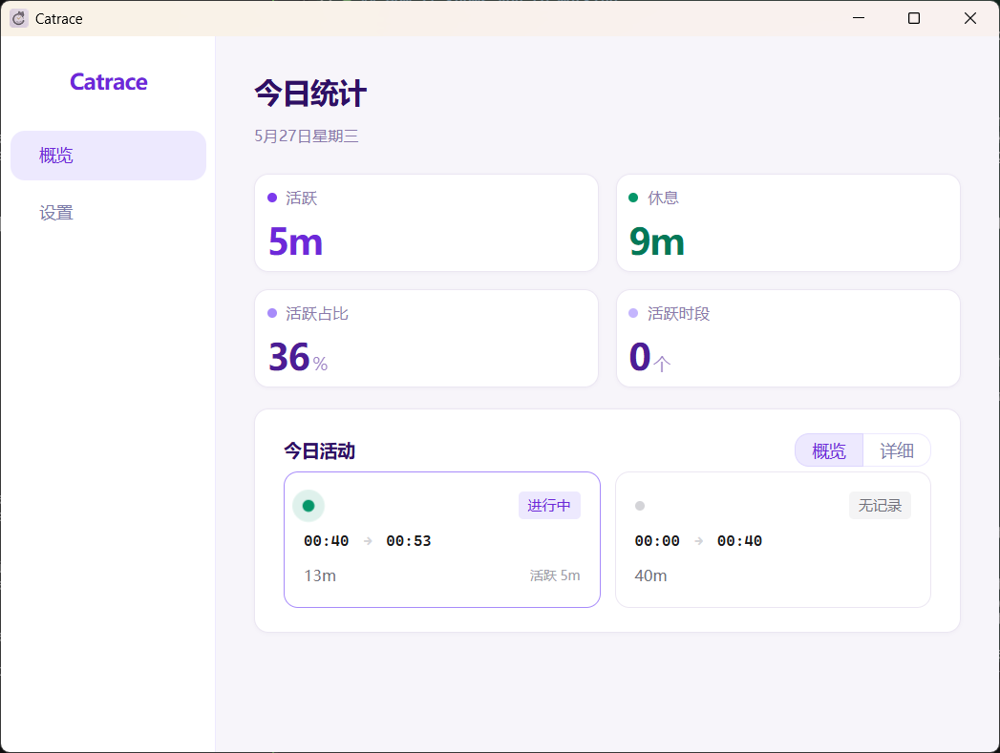

  

<h1 align="center">Catrace</h1>

  <strong>桌面事件系统 · 小窗平台</strong> 
  本地优先 · 免费开源 · 万物皆插件

  
  
  
  

  <a href="https://github.com/lanxiuyun/Catrace/releases/latest">下载</a> ·
  <a href="https://github.com/lanxiuyun/catrace-plugin">插件仓库</a> ·
  <a href="https://lanxiuyun.github.io/Catrace">官网</a> ·
  <a href="README_EN.md">English</a>

## Catrace 是什么

Catrace 是一个**桌面事件系统**——一条贯穿系统的事件总线，一套管着所有小窗的运行时。

它的核心不在「提醒」，而在**窗口本身**：插件可以随时打开、收拢、移动、装扮一个小窗，把小窗变成任何东西——一个全屏盖住屏幕的休息闹钟，一张轻量桌面，或一块大家一起落笔的画布。VSCode 管的是代码编辑；Catrace 管的是**小窗的生命周期**。想在小窗里显示什么、怎么交互，由插件说了算。

内置的久坐提醒、定时提醒只是第一批住在小窗里的居民；更多能力以插件形式接入，一次安装，随用随开。

## 小窗可以是什么

- **久坐提醒** — 忙满一个工作窗口（比如 45 分钟）没歇够，右下角弹一张卡；嫌温柔就改为全屏盖住屏幕，不站起来点不掉。
- **定时提醒** — 每小时喝口水、下午三点看一眼数据、下班前记得打卡，间隔或固定时刻都行，设一次就交给小窗。
- **AI 助手进度** — 终端里跑着 Claude Code、Codex 时，跑到哪一步、要不要授权，小窗先告诉你，不用来回切窗口。
- **蓝牙耳机** — 耳机一连上电脑，听歌软件自动打开；断开时按你的设置暂停或收尾。
- **手机消息** — 短信、App 通知、验证码转发到电脑，落在右下角小窗里。
- **GitHub 动态** — 有人提 issue、点 star，第一时间知道。

> [!NOTE]
> 它不拍屏幕、不看文件、不上传数据。判断忙闲只靠鼠标键盘的动静、前台开的是哪类软件——这些记录全在你自己的电脑里。

## 下载

Windows / macOS / Linux，可开机自启，装上即用。插件无需编译，从**文件夹或 zip 安装**即可。

**[下载最新版本](https://github.com/lanxiuyun/Catrace/releases/latest)**

## 怎么判断你忙不忙

不猜你「计划坐多久」，只看实际在不在忙：

- 首次碰到键鼠开始计时；
- 中途倒水、回消息、发呆，只要没连着停几分钟，都算还在节奏里；
- 一动不动好几分钟，才记作休息；
- 忙满一个工作窗口没歇够，小窗就会弹出来。

安静看视频、听音乐时键鼠半天不动，它会听系统声音，知道你还在用屏幕，不算休息。

## 插件与社区

插件仓库在 [catrace-plugin](https://github.com/lanxiuyun/catrace-plugin)：内置功能开箱即用，想装的插件从本地文件夹或压缩包安装，想关随时关。想自己动手写插件，协议与示例都在那边。

## 友链

