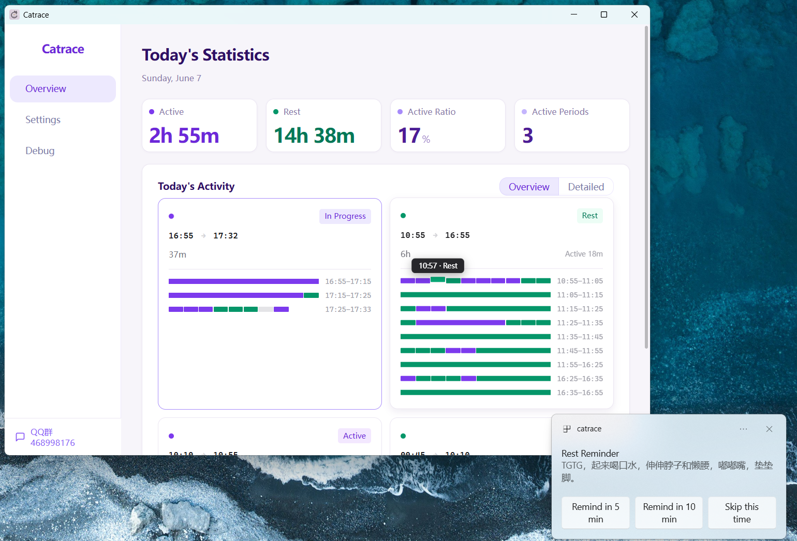

  

<h1 align="center">Catrace</h1>

  <strong>A small tool that helps you balance work and rest</strong> 
  Sedentary reminder · Forced breaks · Water check-in · Eye care

  
  
  
  

  <a href="https://github.com/lanxiuyun/Catrace/releases/latest">
    ⬇️ <strong>Download latest release</strong>
  </a>
  &nbsp;&nbsp;|&nbsp;&nbsp;
  <a href="https://lanxiuyun.github.io/Catrace">
    🏠 <strong>Homepage</strong>
  </a>
  &nbsp;&nbsp;|&nbsp;&nbsp;
  <a href="https://github.com/lanxiuyun/Catrace">
    💖 <strong>Like it? Give us a star!</strong>
  </a>

  <a href="README.md">中文</a> | English

## What it does

Many people sit in front of the computer for hours, and by the time they realize it, their back and neck are already sore.
Catrace is here to solve this problem — it quietly watches your activity in the background, and when it detects you've been working continuously for too long, it reminds you to stand up and take a break.

## How it knows you're busy

It doesn't take screenshots of your screen, nor does it read what you're doing. It simply checks whether your mouse has moved or your keyboard has been tapped.

Then it follows a simple set of rules:

- It also detects when you're consuming screen content (watching videos, listening to music, or viewing live streams), so even periods with little keyboard/mouse activity can still count as active. On Windows, this is determined by system audio output matched against an exclusion list for the audio-output process; this feature is not yet available on macOS / Linux.
- It starts counting from the first time you type or move the mouse today.
- If you get up for water, reply to a message, or zone out — as long as you don't stop for a continuous stretch, it still considers you in the same work rhythm.
- Only when you truly pause and stay still for several minutes does it mark that time as rest.
- If you power through a full "work window" (say, 45 minutes) without enough rest in between, or you rest and then fill another full window, it pops up a gentle reminder: time to take a break.

## How it reminds you

When it's time, Catrace reminds you to take a break using your chosen method. Two reminder modes are available:

- **Notification Reminder** — Floating notification cards stack in the bottom-right corner; each card has three buttons: "Remind in 5 min", "Remind in 10 min", and "Skip this time". Hovering a card pauses its countdown timer. When you start resting, an additional green liquid-ball timer appears: the liquid level rises with your rest progress and has a flowing wave animation, showing how long you've rested and whether you've reached the valid rest threshold. On Windows, the notification window does not steal the current input focus, so renaming files or typing in another app is not interrupted
- **Fullscreen** — A full-screen overlay that forces you to stop and rest, with customizable background image, fit mode, and overlay opacity

You can customize your work window length and rest threshold to find the rhythm that suits you best.

## Water Reminder

In addition to reminding you to stand up and rest, Catrace can also remind you to drink water at your chosen interval, so you don't forget to stay hydrated while busy.

- Checks only when you are currently active; it won't bother you while resting.
- Pops a blue water reminder Toast in the bottom-right corner, matching the Dashboard water widget theme; click "Drank" to log a glass.
- Use the water widget on the Dashboard to manually add or remove today's drink count and view your drinking timeline.

> As soon as you start resting (even just one minute), reminders stop automatically. They won't keep buzzing while you're on a break. They only resume after you get back to work.

## Eye Care Reminder

Staring at a screen for hours makes your eyes dry and tired, so Catrace can also remind you at your chosen interval to look away and relax your eyes.

- Checks only when you are currently active; it won't bother you while resting.
- Pops a green eye-care Toast card in the bottom-right corner that auto-closes after a 25-second countdown — no manual action needed.
- The card has two buttons, "Snooze 5 min" and "Skip this time", so you can pace yourself.

## Agent Notifications

If you're a heavy user of AI coding agents, Catrace can also keep an eye on them for you.

- Supports agents like Claude Code, Codex, Gemini CLI, and Kimi. Once you install the official hook, it automatically receives status events (session start, prompt submit, stop, stop failure, notification, etc.).
- Each event has its own display policy: Off / Auto / Sticky.
- Claude's permission requests (PermissionRequest) pop up a card where you can Approve or Deny directly — no need to switch back to the terminal.
- The Settings page provides one-click hook install/uninstall per agent, plus a customizable notification sound.

## Friends

## Contributing

See the [Contributing Guide](CONTRIBUTING.md) to get involved.
